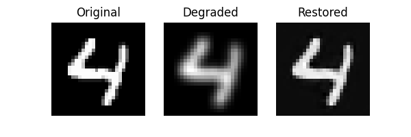
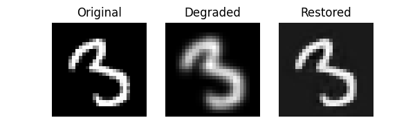
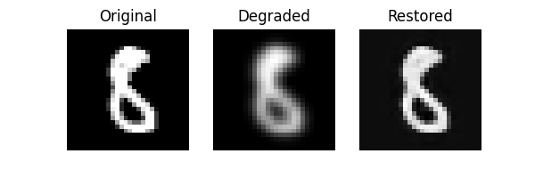

# MNIST 숫자 이미지 복원 (Super Resolution with CNN)

## 📌 프로젝트 개요
이 프로젝트는 해상도가 낮아진 숫자 이미지를 딥러닝 모델을 이용해 복원하는 간단한 Super Resolution 실험입니다.

- 데이터셋: MNIST
- 저해상도 변환: 28x28 → 14x14 다운샘플 → 다시 28x28 업샘플
- 모델: 3-layer CNN
- 목표: Degraded된 이미지를 원래대로 복원하는 것

## 🧠 사용 기술
- Python
- PyTorch
- Matplotlib

## 💡 주요 결과
모델이 원본 이미지와 유사하게 복원한 이미지 예시:

| Original | Degraded | Restored |
|----------|----------|----------|
|  |  |  |

